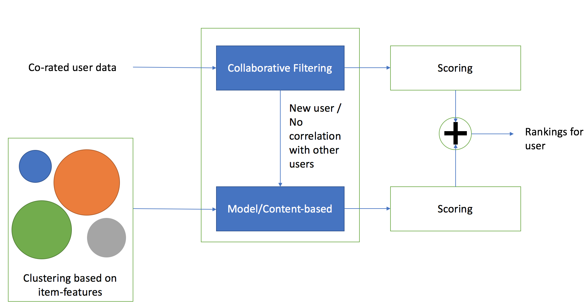
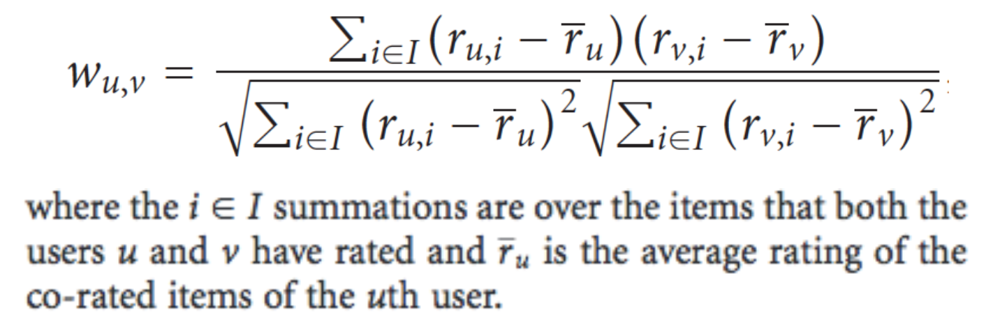
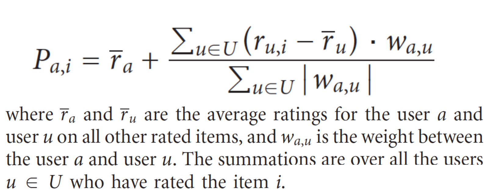

# Hybrid Movie Recommender System

This is a hybrid recommender system that uses a hybrid of model-based recommender based on clustering and a collaborative filtering approach based on Pearson correlation between different users. The hybrid is created as displayed in the image below.



The subset of movie lens dataset that was taken had good correlation between co-rated users. Thus the model was used for predicting ratings for new users. The scoring from each of the recommender is mutually exclusive therefore, it doesn't require special aggregation scheme.

The ratings for each user are taken and ranked. The movies with ratings greater 4 & 5 will be provided as output.

## Collaborative filtering
The collaborative filtering module was constructed with a basic Pearson correlation for identifying neighborhood of similar users and a weighted scheme to calculate the ratings.



The definitions are taken from the book Mining Massive Datasets by Jure Leskovec, Anand Rajaraman, Jeff Ullman ([reference here](http://www.mmds.org/#ver21)).

The neighborhood users set `U` are chosen based on a hyper-parameter, number of neighbors `N`, which is determined using cross-validation (10 folds). Experiments with 25-50 neighbors gave good results.

## Clustering of Movies

A simple hierarchical agglomerative clustering method with average linkage approach was used to cluster the movies. Various features were tried and identified that `Genre` of the movie provided selected based on the given dataset. Silhouette coefficient was used to measure the quality of clusters. Used the Scipy's implementation of [clustering](https://docs.scipy.org/doc/scipy/reference/generated/scipy.cluster.hierarchy.fclusterdata.html#scipy.cluster.hierarchy.fclusterdata).

The threshold is chosen based on cross validation where the objective was to identify the maximum silhouette coefficient.


## Experiments

A separate test dataset was constructed with more new users (specifically to test the model) and ensuring the distribution was consistent with the training.

As a baseline, the approach is compared with ALS method provided by spark. The approach is also comapred with a simple User CF based approach where the cold starts are handled by choosing a rating from a Gaussian distribution of ratings with mean as mean and standard deviation calculated from the entire training dataset.
Root mean square error measure is used to determine the quality of recommender system. The results are given below.

```
ALS => Rank = 3, RMSE = 1.074
Simple User CF  - without model => Neighbors = 25, RMSE = 0.9750
Hybrid Recommender => Neighbors = 25, RMSE = 0.9483
Hybrid Recommender => Neighbors = 30, RMSE = 0.9341
```

## Remarks
The model based hybrid approach works well and performs consistently well with in terms of complexity (time taken to run) and the RMSE measure.
